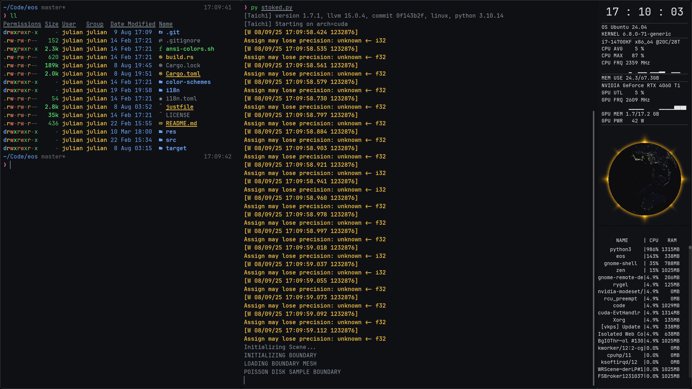

<h1 align="center">EOS TERMINAL</h1>

    

A terminal emulator with an integrated resource monitor and space for shader art.
Based on [Alacritty](https://github.com/alacritty/alacritty), forked from the [Cosmic Terminal](https://github.com/pop-os/cosmic-term), written in Rust and WGSL.

## Screenshot

